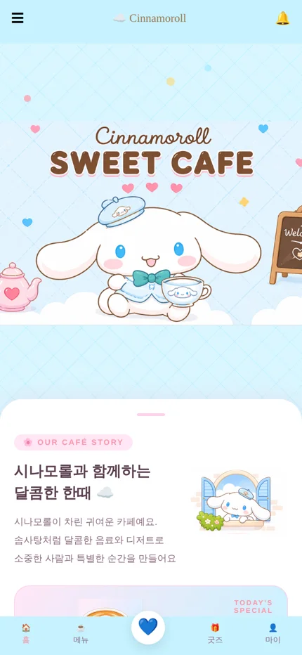
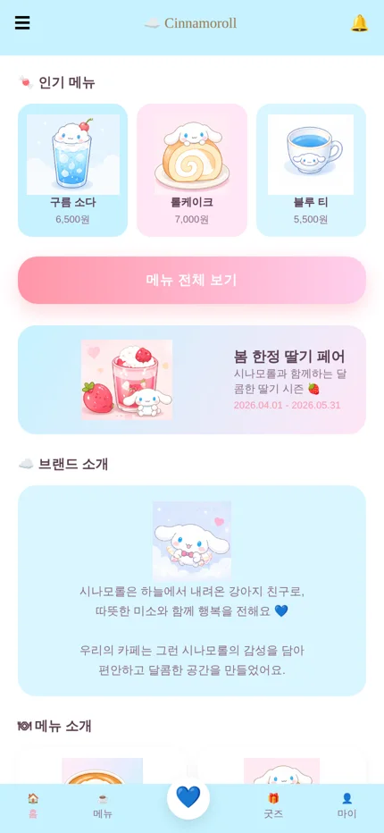

# Cinnamoroll Sweet Café ☁️ — 캐릭터 테마 카페 홍보 사이트

> "시나모롤이 차린 귀여운 카페"라는 콘셉트로 만든 카페 홍보용 모바일 웹페이지입니다.
> 실제 카페 사이트의 구성을 참고해 브랜드 소개, 메뉴, 이벤트를 한 페이지에 담았습니다.

**🔗 사이트 바로가기** · https://puremion-rgb.github.io/cinnamoroll_home/

  
  

 

## 📌 프로젝트 개요

| 항목 | 내용 |
| --- | --- |
| 구분 | 수업 과제 (개인) |
| 과제 | 카페 사이트를 참고해 홍보할 카페 사이트 만들기 |
| 담당 | 기획 · 디자인 · 퍼블리싱 전체 |
| 플랫폼 | 모바일 웹 |

 

## ✨ 페이지 구성

| 섹션 | 내용 |
| --- | --- |
| 메인 배너 | Cinnamoroll Sweet Cafe 대표 이미지 |
| Our Café Story | 카페 콘셉트 소개 |
| Today's Special | 시그니처 메뉴 "시나모롤 라떼" 소개 |
| 인기 메뉴 | 구름 소다 · 롤케이크 · 블루 티 카드 |
| 시즌 이벤트 | 봄 한정 딸기 페어 (2026.04.01 – 05.31) |
| 브랜드 소개 | 시나모롤 캐릭터와 카페의 분위기 |
| 메뉴 소개 | 전체 메뉴와 가격 |
| 추천 조합 | BEST SET — 시나모롤 라떼 + 롤케이크 |
| 하단 탭 | 홈 · 메뉴 · 굿즈 · 마이 |

 

## 🎨 디자인 포인트

- **캐릭터에서 뽑은 컬러**: 시나모롤의 하늘색과 연분홍을 메인 · 서브 컬러로 정하고 CSS 변수로 관리했습니다.
- **앱 같은 모바일 화면**: 상단 헤더와 하단 탭 바를 고정해 실제 카페 앱처럼 보이도록 구성했습니다.
- **부드러운 움직임**: `popIn`, `floatY`, `slideUp` 키프레임 애니메이션으로 요소가 떠오르고 둥실 떠 있는 느낌을 줬습니다.

 

## 🛠 기술 스택

| 구분 | 사용 기술 |
| --- | --- |
| Markup · Style | HTML5, CSS3 (CSS 변수, Flexbox, Grid, Keyframe Animation) |
| Font | Noto Sans KR, Pacifico (Google Fonts) |
| Deploy | GitHub Pages |

 

> ⚠️ 본 프로젝트는 학습용으로 제작된 비상업적 과제이며, 시나모롤 캐릭터의 저작권은 Sanrio에 있습니다.
